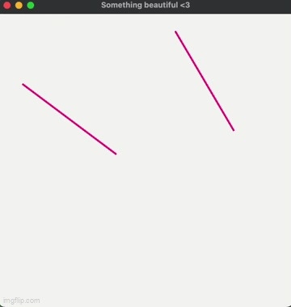

# Описание задания

### Реализация программы интерактивного управления отрезками в двумерном пространстве (сдвиг, поворот, масштабирование).

---

Для того, чтобы можно было работать с диалоговым окном, строить отрезки и производить действия с ними, я использовал стороннюю библиотеку `<gtk/gtk.h>(gtk+3)`. Далее двумя разными функциями были написаны функции построения обычного отрезка из одной точки в другую и другой отрезок по алгоритму Брейзенхема.

В файле [`CMakeLists.txt`](https://github.com/gr1shan1a/Computer_Graphics_course/blob/main/lab1/CMakeLists.txt) прописана конфигурация для подключения библиотеки `<gtk/gtk.h>(gtk+3)`

- одна из линий была построена с помощью библиотеки `gtk+3` просто соединением двух координат
- вторая была построена по алгоритму Брезенхема(см. `line_of_Bresenhem`)

--- 

## Animation of work
