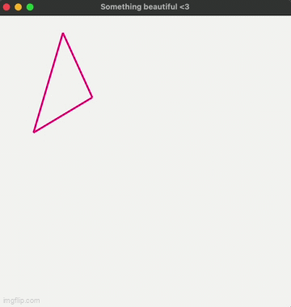

# Лабораторная работа №2 
## Реализация программы интерактивного управления плоским многоугольником в двумерном пространстве (сдвиг, поворот, масштабирование).

### Вариант 1 - треугольник

Done: using gtk+3 and Drawer algorithm for shading

- Были выбраны точки и между ними проведены отрезки
- поворот был реализован с помощью пересчета точек относительно центра треугольника: `(x1 + x2 + x3) / 3.0` для `x`, аналогично для ординаты точки центра `(y1 + y2 + y3) / 3.0`
### Provides:
- 2D moving 
- rotating
- scaling

--- 

## Animation of work
